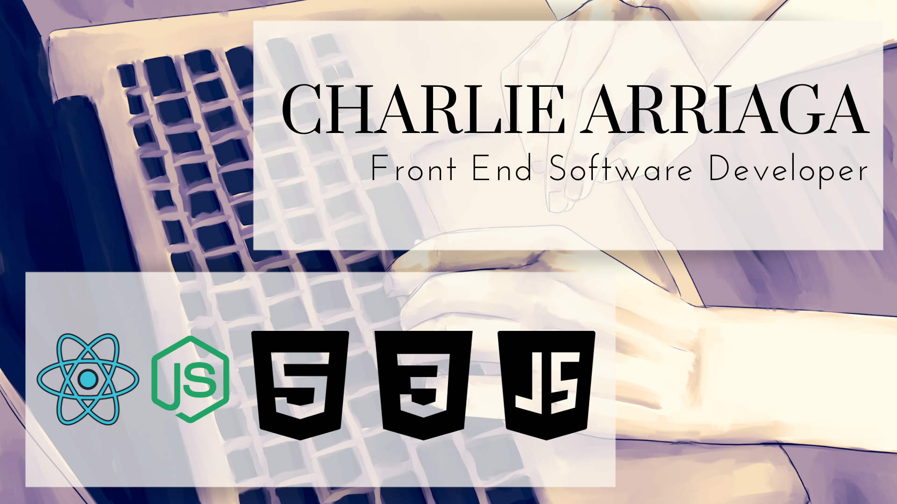

 
    

### Libraries and Technologies

As a front end oriented developer, I specialize in JavaScript, HTML5, and CSS3. I utilize Node.js and npm to broaden my scope and use React as well as vanilla JavaScript to handle my front end work.

### Professional Competencies

#### Leadership

- Takes responsibility for actions. Handles tasks and decisions seriously and takes pride in work.

- Takes initiative and owns outcomes, both positive and negative, of my work. Embraces leadership opportunities.

#### A Growth Mindset

- A curious and inquisitive mind. Seeks opportunities to learn and hone craft.

- Seeks constant self improvement, both as a person and as a software developer. Identifies and refines room for improvement.

- Open to new ideas and ways of thinking. Willing to challenge older frames of thought and always looking for progress.

#### Quality Focused

- Able to problem solve and find root cause issues. Implements proper solutions.

- Able to judge situations and problems with an analytical mind. Navigates troubleshooting with an organized approach.

- Takes pride in a job well done.

### A Non Traditional Background

My journey into the world of tech started during the pandemic. I was on medical leave and had just received the news from my doctor that I wouldn't be able to return to work at all.

Before that, I had had jobs in warehouses, aerospace manufacturing, and food service. All of these were stressful, physically demanding industries that I could no longer return to due to my declining health. I needed a new path.

After some research, I discovered the Google IT support certification program. I enrolled and discovered the wonderful world of information technology. I took to it like a fish to water and was immediately hooked. But emergencies and life circumstances took me away from schooling before I could finish it.

Discouraged by my inability to finish and once again unable to work, I abandoned that career path and instead honed my skills in fine arts while my health recovered. I attended art school and began accepting art commission work on the side. Soon I was running my own business creating merchandise and designing books.

As successful as I was, money was tight, and a year later, after my application for disability was denied for the fourth time, I tried to properly re-enter the workforce.

Second verse, same as the first.

Once again I found myself being told by a doctor that I could not work in my fields of experience. I needed to find a job with minimal physical activity.

My support circle encouraged me to look back into IT. After some digging, I discovered a local coding bootcamp and took the jump. And here I am today.

### resources:
- header: Canva and Clip Studio Paint
- LinkedIn logo: Icons8
